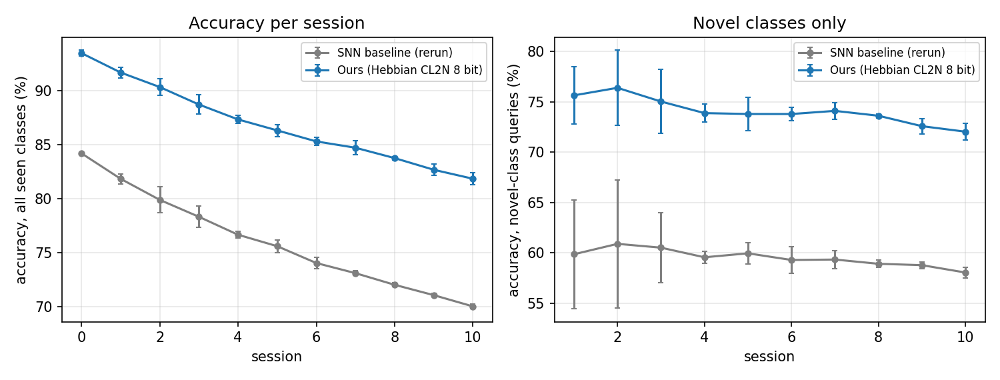
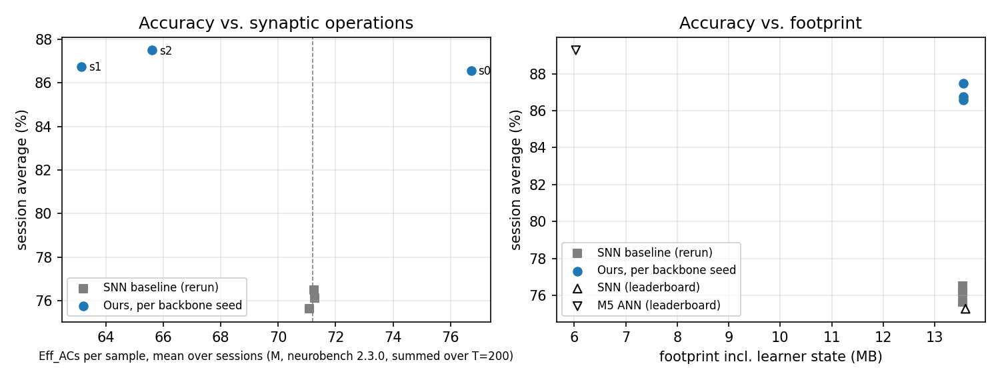

# Integer three-factor prototype learning for spiking keyword FSCIL on NeuroBench MSWC

> Every number in this report comes from a logged run: `results/official_runs.jsonl` (official runs),
> `results/pseudo_eval.jsonl` (pseudo protocol) and `EXPERIMENT_LOG.md`. Figures are generated from
> `results/official_runs.jsonl` by `scripts/make_figures.py`.

## Abstract

We study the NeuroBench v1.0 Keyword FSCIL task (MSWC): 100 base classes followed by 10 sessions of
10-way 5-shot learning, scored by the accuracy averaged over the 11 sessions. The published SNN reaches
93.48% base and 75.27% session average. We keep the same RadLIF RSNN architecture and Speech2Spikes input and
change two things: (1) the backbone is pretrained with a centred cosine classifier, so that the spike-count
geometry matches a prototype readout, and is stabilised by relative gradient clipping; (2) new classes are
learned only by a local, integer three-factor Hebbian rule that produces centred, L2-normalised 8-bit
prototypes, with a bit-exact event-driven reference model. On the official harness (neurobench 2.3.0, one
official run, 3 seeds) the system reaches **86.93 ± 0.40% session average** and 93.48 ± 0.26% base accuracy
(base measured with the incremental readout), against 76.09 ± 0.36% for our rerun of the SNN baseline on the
same harness. The parameter footprint is unchanged (13,550,384 B, plus 5,124 B of learner state) and the
effective synaptic operations are 3.8% lower on average (68.50M vs 71.20M per sample), with one of the three
backbone seeds 7.8% above the baseline.

## 1. Introduction

- Problem: on-device few-shot keyword learning with an SNN, no backprop after deployment.
- Gap: the SNN baseline loses 9.17 pts at session 0 when its trained readout is replaced by
  prototypes (NeuroBench paper, Nat. Commun. 16:1545, 2025); new-class accuracy 57.23% vs 79.61% (ANN).
  Our rerun confirms this: 84.21% base with the prototype readout, 59.52% novel-class accuracy.
- Contributions:
  1. Centered, L2-normalized integer prototypes learned by a three-factor Hebbian rule, with a
     bit-exact hardware reference model.
  2. Base training aligned with the deployment readout: centred cosine-classifier pretraining of the RSNN,
     made stable across seeds by relative gradient clipping (§4.2). This is the largest single gain.
  3. Full NeuroBench metric report and Pareto comparison with both baselines, including a correction to how
     recurrent synapses are counted in our re-implementation (§4.4).

## 2. Task and protocol

- Official task: see `docs/protocol.md` (unchanged task definition, unchanged harness metrics,
  neurobench 2.3.0, upstream commit e521c28).
- Inputs come from a one-time S2S cache produced by the upstream encoder (48 kHz, hop 240, threshold 1).
- Session sampler: same sampling distribution as upstream `IncrementalFewShot`
  (random language order, 5 random shots from samples 0–99, queries = samples 100–199), with an
  explicit seed per repeat.
- Validation protocol used for every design decision: pseudo-incremental sessions on held-out base
  languages (fold 0: ca+de, fold 1: fr+rw; 60 pseudo-base classes, 4 sessions × 10-way 5-shot).
- Base accuracy is always measured with the readout used in the incremental sessions.
- Seeds: official seed s uses backbone seed s and session-sampling seed s, so the official std covers both
  backbone training and session sampling. Official std is the population std (`np.std`, as computed by
  `nbfscil.official_eval`); pseudo-protocol std is the sample std over 3 backbone seeds (ddof = 1), each
  backbone averaged over 5 protocol seeds.

## 3. Method

### 3.1 Backbone
RadLIF RSNN, layer sizes 1024-1024 (same as the NeuroBench SNN), S2S input (20 channels), T = 200 steps, zero
initial state. Graph-capturable re-implementation, bit-level equal to upstream (`tests/test_snn_equivalence.py`).

Training recipe (`configs/exp/cos_1024_amp_clip.yaml`), all 100 base classes, base train split only:
- Loss: centred cosine classifier on the summed last-layer spike counts, `CE(16 · cos(S − μ, w_c))`, where μ is
  an EMA (0.01) of the batch-mean spike count, i.e. the same centre the incremental learner later stores. The
  classifier is discarded after training.
- Adam, lr 1e-3, weight decay 1e-4, batch 256, 50 epochs, step decay at epoch 20, mixed precision (amp),
  dropout 0.1, no data augmentation.
- Relative gradient clipping: the gradient norm is capped at 2× an EMA of recent accepted norms
  (`grad_clip_rel: 2.0`). A fixed threshold is scale-dependent; the relative cap only acts on spikes.
- Seeds 0, 1, 2; trained cosine-readout val accuracy 94.81 / 95.63 / 95.62%.

### 3.2 Three-factor integer prototype rule
- Learning: `ΔA_ci(t) = pre_i(t) · post_c(t) · M(t)`, integer accumulators (11 bits suffice for a 5-shot session;
  24 bits are provisioned for the offline base classes, 500 samples × 200 steps).
- Consolidation per class: `D = A·2^f − n·μ_q`, `N = isqrt(ΣD²)`, `w = clip(⌊(D·G + r)/N⌋)` with
  xorshift32 stochastic rounding, `b = −⌊μ_q·w / 2^f⌋`; f = 4 fractional bits, `G = round(w_max·√dim / 4)`.
- Inference: `score_c = Σ_i S_i w_ci + b_c` as event-driven ACs in the sum-over-time readout. In the harness
  this is the RSNN's own readout layer with `W` and `b / T`, so the harness measures this computation.
- Weight bits: 8 (w ∈ [−127, 127]). Stored state beyond weights: `μ_q` (1024 × 16 bit) + one accumulator bank
  (1024 × 24 bit) + PRNG state = 5,124 B (`extra_footprint_bytes`).
- Base classes are learned by the same rule from the base train split (offline, once).

### 3.3 Hardware plausibility
- Operations used after deployment:

  | Phase | Operations | Per |
  |---|---|---|
  | Learning (accumulate) | integer add (`A_ci += 1` on a hidden spike while post_c and M are high) | hidden spike event |
  | Consolidation | subtract, multiply (`D·D`, `D·G`, `μ_q·w`), one integer square root, integer divide, clip, shift, xorshift32 | class, once per session |
  | Inference | integer accumulate of `w_ci` per hidden spike, add bias, argmax | hidden spike event |

  No gradients, no floating point, no raw-data replay; each class neuron uses only its own synapses plus two
  shared constants (μ_q and G).
- Bit-exact reference: `hw_model/prototype_rule.py`, verified by `tests/test_hw_model.py` (8 and 4 bit,
  stochastic and nearest rounding, centred and uncentred; learning and inference scores equal bit for bit).
- Cost per incremental update: one add per hidden spike of the 5 support samples of a class (accumulate), then
  per class 4 × 1024 multiplies (`n·μ_q`, `D·D`, `D·G`, `μ_q·w`), 1024 divides, 1024 PRNG draws and one isqrt (consolidation). These counts
  follow from the rule; the harness does not measure learning-time cost.

## 4. Experiments

### 4.1 Baseline reproduction (Phase 2)
| Config | Base (proto readout) | Session avg | Notes |
|---|---|---|---|
| Upstream SNN checkpoint + upstream prototype readout, official run 1/5 | 84.21 ± 0.06% | 76.09 ± 0.36% | `configs/baseline_snn.yaml`, seeds 0 1 2; paper proto session 0 ≈ 84.3%, leaderboard avg 75.27% |
| RSNN re-trained with upstream recipe (CE readout), pseudo protocol fold 0, euclid prototypes | 69.13 ± 2.37% | 60.37 ± 1.36% | `configs/rsnn_baseline_train_amp.yaml`, 3 backbone seeds; pseudo protocol, not comparable to the official numbers |

Known deviation: ActivationSparsity on the GSC example is 0.9072 vs 0.9669 in the upstream README
(metric refactor in neurobench v2); accuracy and synaptic ops match exactly. On MSWC the baseline rerun gives
activation sparsity 0.917 vs 0.916 on the leaderboard, so the drift seen on GSC does not show up here.

### 4.2 Pseudo-protocol ablations (design decisions)
Final backbone recipe (`cos_1024_amp_clip`), 3 backbone seeds per fold, 5 protocol seeds each:

| Learner | Fold 0 session avg | Fold 1 session avg | Novel acc (f0 / f1) | Last session (f0 / f1) |
|---|---|---|---|---|
| Euclid prototypes (upstream rule, float) | 86.43 ± 1.15 | 84.91 ± 0.51 | 74.32 / 56.92 | 82.53 / 77.48 |
| Float CL2N | 85.84 ± 1.18 | 84.12 ± 0.36 | 70.13 / 51.52 | 81.54 / 76.30 |
| **Hebbian CL2N 8-bit (submitted)** | 85.24 ± 1.51 | 83.87 ± 0.42 | 70.55 / 52.56 | 81.02 / 76.03 |
| Hebbian CL2N 4-bit | 85.20 ± 1.51 | 83.82 ± 0.45 | 70.41 / 52.57 | 80.94 / 75.97 |
| Centering only, 8-bit | 79.70 ± 1.62 | 78.91 ± 0.89 | 50.75 / 33.44 | 72.79 / 68.43 |
| L2 only, 8-bit | 13.52 ± 1.05 | 6.67 ± 1.48 | 6.31 / 0.00 | 10.16 / 5.16 |

- The integer 8-bit rule costs 0.6 / 0.25 pts vs its float counterpart and 1.2 / 1.0 pts vs float Euclidean
  prototypes. Euclid is not submitted because it is not the integer local rule (win condition 3).
- 4 bit ties 8 bit on both folds. 8 bit was chosen because the pseudo protocol has 100 classes in total, the
  official task 200, and 4 bit was not tested at that scale.
- Both terms are needed: without centring, low-bit L2 prototypes collapse (a few always-on neurons dominate the
  unit vector and the class-specific part rounds away); without normalisation, scores are not cosine-like.

Backbone ablations, fold 0, Hebbian CL2N 8-bit (session avg, 3 backbone seeds):

| Backbone recipe | Session avg | Trained-readout val | Change |
|---|---|---|---|
| CE readout (upstream recipe) | 61.40 ± 1.57 | 92.23 / 92.08 / 91.80 | — |
| Cosine classifier, step LR | 76.51 ± 5.66 | 91.73 / 85.62 / 90.77 | + centred cosine loss |
| Cosine classifier, cosine LR + warm-up | 67.25 ± 13.99 | 76.05 / 88.95 / 88.58 | rejected |
| **Cosine classifier, step LR, relative clipping** | 85.24 ± 1.51 | 93.65 / 93.03 / 93.67 | + `grad_clip_rel 2.0` |

The cosine loss closes most of the trained-readout vs prototype gap (fold 0, seed 0: 23 pts → 4 pts), but alone
it is unstable across seeds; the per-epoch logs show gradient-norm spikes of 10²–10⁴ × the mean with no
non-finite steps. Relative clipping acts on 2–25 of 117 steps per epoch and removes the instability. Layer size
and augmentation were not varied.

### 4.3 Official evaluation (final configs only)
| Run | Config | Commit | Seeds | Base | Session avg |
|---|---|---|---|---|---|
| 1/5 | `configs/baseline_snn.yaml` | ba7ad52 (jsonl: b65d03e, hash read at run end) | 0 1 2 | 84.21 ± 0.06% | 76.09 ± 0.36% |
| 2/5 | `configs/final/clip_cl2n_8bit.yaml` | 15622d7 | 0 1 2 | 93.48 ± 0.26% | 86.93 ± 0.40% |

Run 2 per seed: session avg 86.56 / 86.75 / 87.49%, base 93.11 / 93.72 / 93.60%. With the sample std (ddof = 1)
the session average is 86.93 ± 0.49%. One earlier invocation of run 2 stopped before loading any test data (the
runtime had no `base_test` cache) and wrote no result; it is logged in `EXPERIMENT_LOG.md` and not counted.
All runs are listed, including bad ones.

### 4.4 Full NeuroBench metrics
| Method | Base | Session avg | Footprint (B) | Extra learner state (B) | Exec. rate | Conn. sparsity | Act. sparsity | Dense | Eff_MACs | Eff_ACs |
|---|---|---|---|---|---|---|---|---|---|---|
| M5 ANN (leaderboard) | 97.09% | 89.27% | 6.03E6 | – | 1 | 0.0 | 0.783 | 2.59E7 | 7.85E6 | 0 |
| SNN (leaderboard) | 93.48% | 75.27% | 1.36E7 | – | 200 | 0.0 | 0.916 | 3.39E6 | 0 | 3.65E5 |
| SNN, our rerun (neurobench 2.3.0) | 84.21% (proto) | 76.09% | 1.36E7 | 0 | 200 | 0.0199 | 0.917 | 6.74E8 | 0 | 7.12E7 |
| Ours | 93.48% (proto) | 86.93% | 1.36E7 | 5,124 | 200 | 0.0489 | 0.900 | 6.74E8 | 0 | 6.77E7 |

Session-0 values, mean over the 3 seeds, as in the upstream script. Over all 11 sessions the Eff_ACs are
68.50M ± 5.90M (ours) vs 71.20M ± 0.08M (baseline rerun), −3.8%; per seed 76.72M / 63.16M / 65.62M, so backbone
seed 0 is 7.8% above the baseline. Footprint is 13,550,384 B for both (same parameter tensors); the harness
stores the readout as float32, while the integer learner needs 8-bit weights.

Unit note: neurobench 2.3.0 reports Dense / Eff_ACs per sample summed over all T = 200 steps; the
leaderboard values are ≈ 200× smaller (6.74E8 / 200 = 3.37E6 vs 3.39E6; 7.12E7 / 200 = 3.56E5 vs 3.65E5),
consistent with a per-step count in the older harness. Ops and sparsity are therefore compared only
with our rerun of the baseline on the same harness. Connection sparsity 0.0199 (vs 0.0 on the leaderboard)
comes from zero entries in the checkpoint (e.g. the zeroed recurrent diagonal), counted by the v2 metric; ours
is higher (0.049) mainly because at session 0 the 100 not-yet-learned class rows of the readout are zero
(100 × 1024 weights ≈ 0.030 of all parameters); the baseline readout starts from the trained readout instead.

Counting correction: our first re-implementation computed the recurrent term as `st @ V.weight.t()`, which the
harness does not see (it counts ops through `nn.Linear` hooks), so Dense and Eff_ACs left out both recurrent
1024 × 1024 matrices (Dense 2.55E8 instead of 6.74E8). The model now calls `self.V(st)` as upstream does
(numerically identical); `tests/test_synops_count.py` checks that all five weight matrices are counted. All
official numbers above were measured after the fix (commit c3807ca).

The upstream script copies session-0 synaptic ops to later sessions; we report the harness output per session
as-is. Mean over seeds, sessions 0–10:

| Session | 0 | 1 | 2 | 3 | 4 | 5 | 6 | 7 | 8 | 9 | 10 |
|---|---|---|---|---|---|---|---|---|---|---|---|
| Eff_ACs, ours (M) | 67.70 | 67.75 | 68.08 | 68.14 | 68.34 | 68.57 | 68.58 | 68.81 | 68.92 | 69.17 | 69.42 |
| Act. sparsity, ours | 0.900 | 0.900 | 0.900 | 0.900 | 0.900 | 0.900 | 0.900 | 0.900 | 0.900 | 0.900 | 0.900 |

### 4.5 Per-session accuracy
Mean over seeds 0 1 2, sessions 0–10 (%):

| Session | 0 | 1 | 2 | 3 | 4 | 5 | 6 | 7 | 8 | 9 | 10 |
|---|---|---|---|---|---|---|---|---|---|---|---|
| SNN baseline rerun | 84.21 | 81.85 | 79.91 | 78.34 | 76.68 | 75.62 | 74.06 | 73.13 | 72.05 | 71.09 | 70.05 |
| Ours | 93.48 | 91.68 | 90.34 | 88.72 | 87.34 | 86.33 | 85.31 | 84.73 | 83.77 | 82.69 | 81.86 |

Novel-class accuracy averaged over sessions: 74.08 ± 1.22% (ours) vs 59.52 ± 1.67% (baseline rerun; paper:
57.23%).

### 4.6 Accuracy vs. cost (Pareto)

Left: session average vs Eff_ACs per backbone seed, same harness for both systems. Two of our three seeds are
better on both axes; seed 0 trades 7.8% more Eff_ACs for +10.1 pts over the best baseline seed. Right: footprint;
parameters are identical, our learner adds 5,124 B. The M5 ANN is smaller (6.03E6 B) and 2.3 pts more accurate,
but runs on MACs (7.85E6 per sample) rather than spike-driven ACs, so it has no point on the left panel.

## 5. Discussion and limitations
- Audio backend: upstream SNN was trained with torchaudio 2.0.2 + sox_io; we use torchaudio 2.11. The gap was not
  measured; our baseline rerun is 0.8 pts above the
  leaderboard session average and its base matches the paper's prototype value (84.21 vs ≈ 84.3), so the
  effect on the reference is small.
- Session sampler draws differ from upstream (upstream is unseeded); distribution is the same.
- Backprop is used for offline base training only.
- Eff_ACs depend on the firing rate of each trained backbone (activation sparsity 0.889 / 0.907 / 0.903 for
  seeds 0 / 1 / 2); nothing in the training recipe controls it. A firing-rate regulariser is the obvious next
  step to keep every seed at or below the baseline.
- Novel-class accuracy (74%) is still far below base accuracy (93%), and on the pseudo protocol it depends
  strongly on which languages are held out (fold 0: 70.6%, fold 1: 52.6%). Per-language accuracy was not
  logged in the official run, so the hardest languages are not identified here.
- The 4-bit learner is untested on the official split.

## 6. Reproducibility
`./reproduce.sh` (stages env, cache, test, baseline, pseudo, final, official). The final backbones were trained
on one NVIDIA A100 (about 25 s per epoch); earlier pseudo-protocol runs used a Tesla T4 and an NVIDIA L4.
Pinned versions in `requirements.txt`. Config and commit of every official run in `results/official_runs.jsonl`.
Figures: `python scripts/make_figures.py`. Cost pre-check on base_val without test data:
`python -m nbfscil.cost_check --config <system config>`.

## References
See `docs/landscape.md` (NeuroBench, Nat. Commun. 2025; SimpleShot; C-FSCIL; TEEN; Chameleon; CLP-SNN; …).
